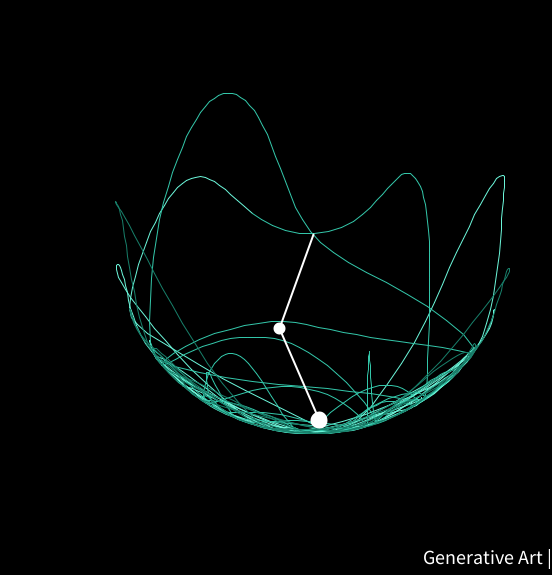

# 🎢 Double Pendulum Simulation

[](https://processing.org/)   

Welcome to the **Double Pendulum Simulation**! 🎨🖥️ This project uses the **Processing language** to demonstrate the beautiful chaos 🌪️ of a double pendulum. The simulation offers a captivating look at the unpredictable and nonlinear behavior of physical systems.



## 🎥 Demo Video

Watch the mesmerizing pendulum in action! 🎬🍿

<video controls src="media/Processing.js - Made with Clipchamp.mp4" title="Double Pendulum Simulation"></video>

## 🌟 Features

✨ **Real-time Physics**: Experience realistic motion with gravity, momentum, and chaotic swings.  
🎮 **Interactive**: Change initial angles and observe the butterfly effect in motion.  
🎨 **Visual Delight**: Clean, simple graphics for a stunning visualization.  
⚡ **Chaotic Dynamics**: A perfect demonstration of sensitive dependence on initial conditions.

## 🚀 Tech Stack

- 🛠️ **Processing**: To create the visual and motion engine.
- 💻 **JavaScript**: For core logic and pendulum motion calculation.

## 🗂️ Project Structure

```plaintext
|-- /media
|   |-- image.png                                  # Screenshot of the simulation
|   |-- Processing.js - Made with Clipchamp.mp4     # Video demo
|-- pendulum.pde                                    # Processing code
|-- README.md                                       # Readme file
```

## 🏃‍♂️ How to Run

1. **Clone the repo** 🧑‍💻:

```bash
git clone https://github.com/Prince-GH/double-Pendulum.git
```

2. **Open** the `.pde` file in Processing or `.js` in p5.js.  
3. **Run** the simulation and enjoy the show! 🎢

## 📈 Roadmap

- 🌟 Add interactive sliders to adjust gravity and arm lengths.
- ✨ Enhance visual effects by drawing pendulum traces.
- 🌬️ Include more physics features like air resistance and friction.

## 🤝 Contributions

Got an idea? 💡 Spot a bug? 🐞 PRs are welcome! Feel free to submit pull requests or issues to help improve the simulation. Let's collaborate to make this even better! 💪

## 🧑‍💻 Author

- GitHub: [prince-gh](https://github.com/prince-gh)

---

Happy Simulating! 🎢✨
